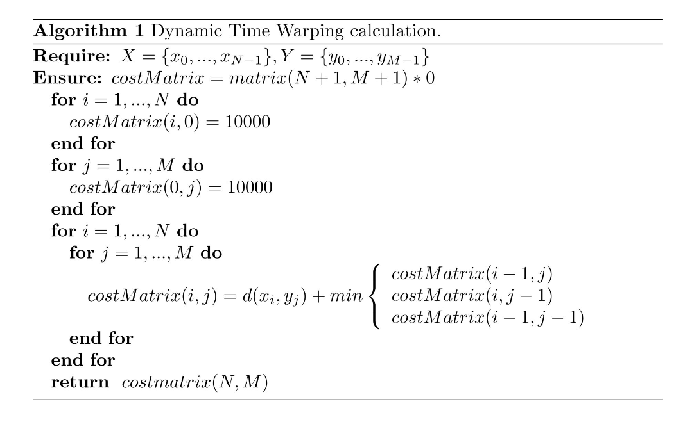

```{r setup, include=FALSE}
knitr::opts_chunk$set(fig.pos = 'H',fig.align="center")
library(knitr)
hook_output = knit_hooks$get('output')

knit_hooks$set(document = function(x) {
  sub('\\usepackage[]{color}', '\\usepackage{xcolor}', x, fixed = TRUE)
})


# knit_theme$set("earendel")
# knit_theme$set("print")
 knitr::opts_chunk$set(linewidth=90, comment=NA,background='grey92') 
 

```

<br>

In this tutorial we will cluster time series databases using different techniques. As an example, we will use the CBF (Cylinder-Bell-Funel) database from the UEA & UCR Time Series Classification Repository (\url{https://www.timeseriesclassification.com}). This database contains series from 3 classes, each of which is represented by one of the shapes shown in the following figure.

```{r, echo=FALSE}
par(mfrow=c(1,3))
x <- seq(-5.1, 5, 0.1)
shape1 <- c(rep(0, 34), rep(1, 34), rep(0, 34))
shape2 <- c(rep(0, 34), x[35:68]-x[35], rep(0, 34))
shape3 <-  c(rep(0, 34), x[68:35]-x[35], rep(0, 34))
plot(x, shape1, type="l", main="Cylinder", ylab="", xlab="",xaxt = "n", yaxt="n")
plot(x, shape2, type="l", main="Bell", ylab="", xlab="",xaxt = "n", yaxt="n")
plot(x, shape3, type="l", main="Funnel", ylab="", xlab="",xaxt = "n", yaxt="n")
```

The dataset is saved in a `data.frame`, where each row corresponds to an instance (a time series, in this case). Additionally, since this dataset is initially designed for supervised classification, the class of each time series is also available, in the last column of the `data.frame`.

Let's load the data and separate the class variable, we will not use it for clustering:

```{r}
CBF <- read.table("./Data/CBF.txt", dec=".", sep=";")
CBFtipo <- CBF[, ncol(CBF)]
CBF[, ncol(CBF)] <- NULL
```

As stated, each time series has one of the three shapes shown in the previous figure. However, for each time series the shape is situated in a different location (shifted), it can be streched or compressed (warped) and it contains noise. Let's see some examples:

```{r}
par(mfrow=c(2,3))
plot(as.numeric(CBF[1,]), type="l")
plot(as.numeric(CBF[3,]), type="l")
plot(as.numeric(CBF[8,]), type="l")
plot(as.numeric(CBF[2,]), type="l")
plot(as.numeric(CBF[4,]), type="l")
plot(as.numeric(CBF[9,]), type="l")
```

# Distance based clustering

In this section, we will first learn about distance computation in R. Then, we will use these distance to cluster a time series database.

## Distance computation using \emph{proxy} and \emph{dtw}

Time series distances are implemented in different packages in R. In this lab, we will use packages \emph{proxy} and \emph{dtw}. First, we will focus on calculating the distance between two time series (the first two of the dataset, for example):

```{r, message=FALSE}
library(proxy)
library(dtw)
```

We will first calculate the Euclidean distnce:

```{r}
#Save the first two series of the database in a data frame:
data <- CBF[c(1,2),]

#Compute Euclidean distance
dist(data, method="euclidean")
```

Similarly we can also compute the DTW distance. Note that, when using function `dtw` we need to choose option `step.pattern = symmetric1` so that the procedure is the one explained in class:

```{r}
# Compute DTW distance
dist(data, method="dtw", step.pattern = symmetric1)
```

In the case of the DTW distance, we can also get additional information about the aligment between the two time series:

```{r}
# Perform alignment
alignment <- dtw(x=as.numeric(CBF[1,]), y=as.numeric(CBF[2,]), keep.internals=TRUE)

# Display the optimal path
par(mfrow=c(1,2))
plot(alignment, type = "twoway", off=2, match.lty=2, match.indices=20)
plot(alignment, type = "threeway")

```

We can also calculate variants such as the Sakoe-Chiba banded distance:

```{r}
# Compute DTW distance with a Sakoe-Chiba band of size 10
alignment_windowed <- dtw(x=as.numeric(CBF[1,]), y=as.numeric(CBF[8,]), step.pattern = symmetric1, 
     window.type="sakoechiba", window.size=10, keep.internals=TRUE)

plot(alignment_windowed, type="density")
```

## Clustering using distances

Now that we know how to calculate distances, to cluster a dataset using a specific time series distance, first, we need to calculate all the pairwise distances between all the time series in the dataset:

```{r}
d1 <- dist(CBF, method="euclidean")
d2 <- dist(CBF, method="dtw", step.pattern=symmetric1)
```

As we saw in class, when we use specific distance measures for time series which are not metrics, we can not use algorithms such as k-means. In these cases it is more suitable to use k-medoids or hierarchical clustering. Let's start with k-medoids:

```{r}
library(cluster)
#Euclidean distance with k=3
clus1.euc <- pam(d1,  k=3, diss=TRUE)
##DTW with k=3
clus1.dtw <- pam(d2,  k=3, diss=TRUE)
```

An object of type \emph{pam} saves diverse information about the clustering result (medoids, clustering, etc.). In order to access the cluster assigments for each instance we do the following:

```{r}
#Euclidean distance with k=3
clus1.euc.groups <- pam(d1,  k=3, diss=TRUE)$clustering
##DTW with k=3
clus1.dtw.groups <- pam(d2,  k=3, diss=TRUE)$clustering
```

Similarly we can also apply hierarchical clustering, implemented in the `hclust` package. In this case, we must provide a distance matrix as input:

```{r}
#Euclidean distance
clus2.euc <- hclust(d1,  method="complete")
#DTW
clus2.dtw <- hclust(d2,  method="complete")
```

In this case, since we know that the number of natural groups in the data is 3, we will cut the dendogram at this level as follows to obtain the cluster asignations of the time series in the database:

```{r}
clus2.euc.groups<-cutree(clus2.euc, k=3)
clus2.dtw.groups<-cutree(clus2.dtw, k=3)
```

However, if we do not know the value of $k$, we can represent the dendogram and select the most suitable $k$ by analyzing the graphic:

```{r}
#Euclidean distance
plot(clus2.euc)
```

# Feature based clustering

Package `tsfeatures` from R, provides the implementation of a large variety of features to describe time series. We will use this package to obtain a feature based representation of our database:

```{r, comment=FALSE}
library(tsfeatures)
```

```{r}
CBF <- lapply(seq_len(nrow(CBF)), function(i) as.numeric(CBF[i,]))
CBFfeatures <- tsfeatures(CBF)
head(CBFfeatures)
```

As can be seen, each row of matrix `CBFfeatures` refers to one time series from our database and each column represents a feature. To see the entire list and explanation of the features included in `tsfeatures` you can go to the following vignette: \bigskip

<https://cran.r-project.org/web/packages/tsfeatures/vignettes/tsfeatures.html> \bigskip

Once we have a feature based representation of our time series, we have eliminates the temporal components and can apply any common clustering algorithm such as k-means with standard distance measures such as the Euclidean distance. We can do this as follows:

```{r}
clusfeatures <- kmeans(CBFfeatures, centers=3)$cluster
```

# Evaluation

In most non-supervised classification problems, we do not have the labels of the instances, so, the most common method to evaluate the results is by visual inspection. However, when we do have information about the ground truth, we can use measures such as the F-measure implemented in the following function:

```{r}
# F measure to evaluate clustering results 
F <- function(clus, true) {
  tab1 <- 2 * table(clus, true)
  tab2 <- outer(rowSums(tab1), colSums(tab1), `+`)
  result <- 1 / length(true) * sum(colSums(tab1) * apply((tab1 / tab2), 2, max))
  return(result)
}
```

In this case,

```{r}
F(clus1.euc.groups, CBFtipo) # K-medoids with Euclidean distance
F(clus1.dtw.groups, CBFtipo) # K-medoids with DTW
F(clus2.euc.groups, CBFtipo) # Hierarchical clustering with Euclidean distance
F(clus2.dtw.groups, CBFtipo) # Hierarchical clustering with DTW
F(clusfeatures, CBFtipo) # K-means with features
```

As you can see, in this case, the best results (based on the ground truth) are obtained with the K-medoids algorithms and the DTW distance. \bigskip

NOTE: You can find more evaluation metrics for clustering in the following reference:\bigskip

S. Wagner and D. Wagner. (2007). Comparing Clusterings - Anoverview. Universitat Karlsruhe (TH), Karlsruhe, Germany, Tech.Rep. 2006-04 [Online]. Available: [http://digbib.ubka.uni-karlsruhe.de/volltexte/1000011477\\bigskip](http://digbib.ubka.uni-karlsruhe.de/volltexte/1000011477\bigskip){.uri}

# Exercises

-   Given these two time series: $X_t=(1, 0, 2, 3, 1, 2)$, $Y_t=(0, 1, 2, 1, 0, 3)$:

    ```{r}

    # Define the data vectors
    x_data <- c(1, 0, 2, 3, 1, 2)
    y_data <- c(0, 1, 2, 1, 0, 3)

    # Convert to time series objects
    Xt <- ts(x_data)
    Yt <- ts(y_data)

    # Print to verify
    print(Xt)
    print(Yt)

    ```

    -   Calculate the DTW distance between these two time series by hand and obtain the optimal aligment between them

        {width="454"}

        ```{r}
        #create cost matrix of size 7x7
        cost <- matrix(0, nrow = 7, ncol = 7)
        print(cost)
        ```

    -   Repeat the exercise using functions `dtw` from package `dtw` in R. Did you obtain the same solution?

    -   Calculate the number of possible paths using function `countPaths`.

    -   If we repeat the operation using a Sakoe-Chiba band of $r=1$, do the results change?

    -   Calculate the obtained distances with the Euclidean and Manhattan distance (calculate them by hand and using R).

-   The database ECG200 (saved in file ECG200.txt), contains a set of time series that measure the electrical activity that happens during a heartbeat. The class variable (represented in the header by `V1`) takes two possible values: -1 if the heartbeat is normal y 1 if there is Myocardial Infarction.

    -   Randomly choose two time series and calculate the DTW, Euclidean and Manhattan distances between them.
    -   Randomly choose a 20% of the time series (maintaining the proportion of the classes) and save them in a matrix ($A$). Choose another 10% (also maintaining the class proportions) and save them in matrix $B$.
    -   Calculate all the pairwise distances between the series in matrix $A$ using different distance measures.
    -   Calculate all the pairwise distances between series in matrices $A$ and $B$ (one series from each matrix) using different distance measures.

-   The `Trace` database from the UEA & UCR archive is a synthetic dataset designed to simulate instrumentation failures in a nuclear power plant. Each class is dedicated to a type of failure. The structure of the database is identical to the one used in the examples above: it is a `data.frame`, each row represents a time series, and the last column is dedicated to the class variable.

    -   Obtain basic information about the dataset, such as the number of classes, the length of the time series, etc. Graphically represent some of the time series. Can we discriminate between the different classes at simple sight? What type of features/distances do you think will be suitable to cluster this dataset?

    -   Remove the class variable from the dataset and perform different clusterings using distance measures and features. Evaluate the results by visual inspection and by using the ground truth (the class variable) and choose the best solution, in your opinion.

# Extra work

-   Additional distances for time series are implemented in other packages, and package `TSdist` makes a compilation of them. Take a look at the contents of this package and try to use other types of features to improve your results.

NOTE: This package has been archived, so in order to install it you will have to do it from source, or using package the \emph{remotes} package.

-   Additional features for time series are implemented in other packages, and package `theft` makes a compilation of them. Take a look at the contents of this package and try to use other types of features to improve your results.

# References

-   Philippe Esling and Carlos Agon. 2012. Time-series data mining. ACM Comput. Surv. 45, 1, Article 12 (December 2012), 34 pages. DOI=<http://dx.doi.org/10.1145/2379776.2379788>

-   T. W. Liao, Clustering of time series data: a survey, Pattern Recognition, vol. 38, no. 11, pp. 1857–1874, Nov. 2005.

-   Anthony Bagnall, Jason Lines, Aaron Bostrom, James Large and Eamonn Keogh, The Great Time Series Classification Bake Off: a Review and Experimental Evaluation of Recent Algorithmic Advances, Data Mining and Knowledge Discovery, 31(3), 2017.

-   Anthony Bagnall, Jason Lines, William Vickers and Eamonn Keogh, The UEA & UCR Time Series Classification Repository, www.timeseriesclassification.com.

-   Toni Giorgino (2009). Computing and Visualizing Dynamic Time Warping Alignments in R: The dtw Package. Journal of Statistical Software, 31(7), 1-24, <doi:10.18637/jss.v031.i07>.

-   U Mori, A Mendiburu, JA Lozano. Distance measures for time series in R: The TSdist package. R journal, 2016.

-   tsfeatures: Time Series Feature Extraction. RJ Hyndman, E Wang, Y Kang, P Talagala. Version 0.1. url: <https://github>. com/robjhyndman/tsfeatures, 2018. 6, 2018
